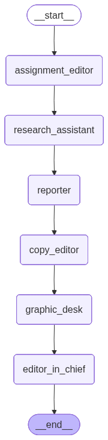
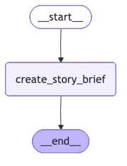
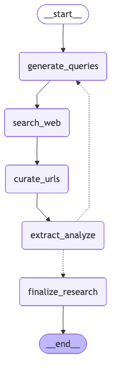
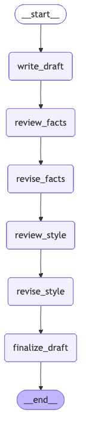
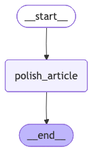
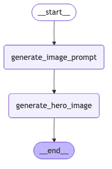
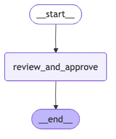

# Architecture

Agentic Newsroom is a multi-agent system built with LangGraph. Each agent is a specialized LangGraph subgraph that handles one part of the editorial pipeline.

## Full Workflow

The complete pipeline runs six agents sequentially:

Each agent receives state from the previous step, processes it, and passes results forward. All artifacts are saved to `artifacts/{slug}/` as the workflow progresses.

## Agents

### Assignment Editor

Transforms a raw article idea into a structured story brief with topic, angle, article type, and key research questions.

### Research Assistant

Conducts iterative web research using Tavily search. Runs multiple turns, generating queries, searching, curating results, and extracting relevant information until research is complete.

### Reporter

Writes the article draft through a two-pass review process: fact review followed by style review, with revisions after each.

### Copy Editor

Polishes the draft into a final article with headline and subtitle.

### Graphic Desk

Generates a hero image for the article using AI image generation.

### Editor in Chief

Reviews the final article against magazine guardrails and approves for publication.

## Key Patterns

- **Subgraph composition**: Each agent is a compiled LangGraph that's invoked from the main workflow
- **Typed state**: Pydantic models ensure consistent data flow between agents
- **Artifact persistence**: Each agent saves its outputs to disk, enabling individual agent runs
- **Model flexibility**: Agents can use either smart or mini models via configuration